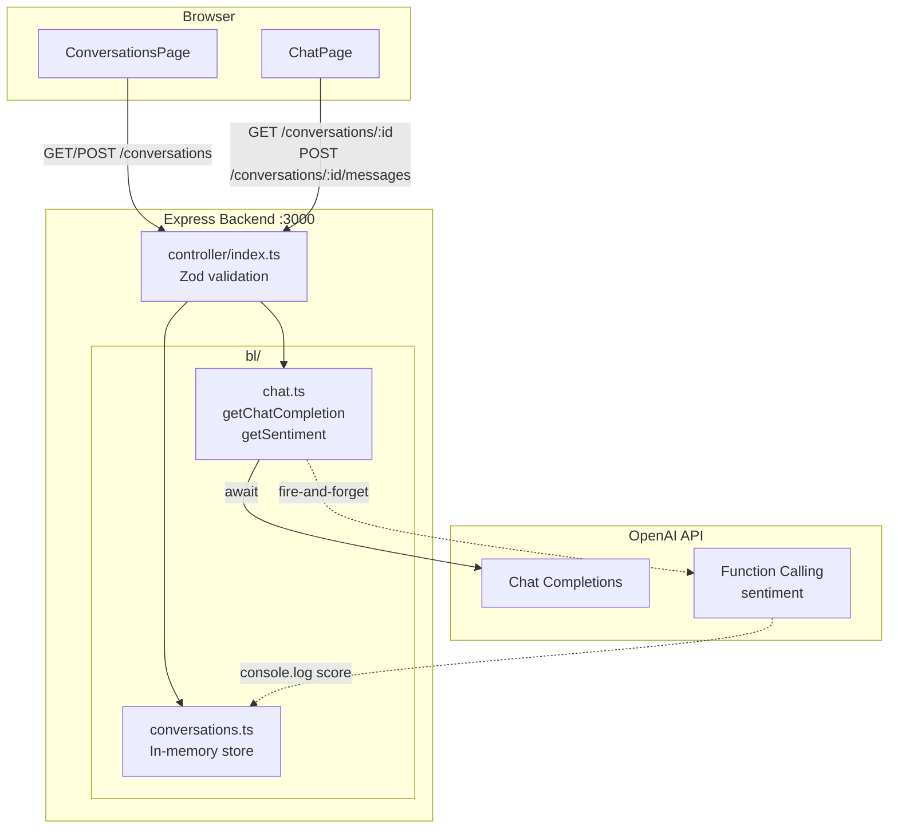

# Implementation Notes

## How to run

```bash
# 1. Copy the env template and fill in your OpenAI key
cp backend/local.env.example backend/local.env
# Edit backend/local.env and set OPENAI_API_KEY=<your-key>

# 2. Backend (port 3000)
cd backend && npm install && npm start

# 3. Frontend (new terminal, Vite dev server)
cd frontend && npm install && npm run dev
```

---

## Architecture



**Key principle:** the controller knows about `req`/`res`; `bl/` does not. This makes the business logic easy to test and reason about independently.

---

## Scale considerations

| Problem | Impact | Mitigation |
|---------|--------|------------|
| **In-memory conversation store** | Single instance only — no horizontal scaling, data lost on restart | Persist to a database (Redis for sessions, Postgres for durable storage) |
| **No auth** | Any client can read or write any conversation by guessing a UUID | Add authentication; scope conversation access to the authenticated user |
| **CORS open to all origins** | Any website can make requests to the API | Restrict to known frontend origins |
| **OpenAI rate limits** | N users = N chat calls + N sentiment calls hitting RPM/TPM limits simultaneously | Queue requests; use exponential backoff with retries; cache common responses |
| **No backpressure / queuing** | Burst traffic hits OpenAI directly — spikes cause cascading 429s | Job queue (e.g. BullMQ) with concurrency limits |
| **Unbounded context growth** | Token count grows with every message — cost and latency increase, response quality degrades | Sliding window or summarisation strategy (see context window section) |
| **No streaming** | Users wait for the full response before anything appears — feels slow on long answers | Use OpenAI streaming API and send chunks to the client via SSE or WebSocket |
| **No retry logic** | Transient OpenAI failures immediately return 502 | Retry with exponential backoff on 429/500/503 |
| **Emoji generator singleton** | All conversations share the same sequence — in a multi-tenant system this is a minor UX quirk | One generator instance per conversation |
| **No observability** | No request tracing, latency metrics, or error rate tracking | Add structured logging, tracing (e.g. OpenTelemetry), and a metrics dashboard |
| **Sentiment as fire-and-forget** | Sentiment failures are silently dropped after logging | Route to a persistent job queue so failed sentiment calls can be retried and stored |

---

## Decisions

### Environment config

- `local.env` is gitignored — secrets never touch git history
- `local.env.example` is committed as a template
- Config is parsed and validated with **Zod** at startup — the server crashes immediately with a clear message if a required variable is missing, rather than failing silently at runtime

### Frontend API base URL

- Hardcoding `localhost:3000` would break in any non-local environment
- Using Vite's `import.meta.env.VITE_API_BASE` means local dev, staging, and production each set their own value without code changes

### Emoji signing

The requirement says *"the bot always signs each message with a different emoji"*. Two approaches considered:

**Option A — Instruct the LLM via system prompt**
The LLM appends its own emoji. Simple to implement, but unreliable: the model may repeat an emoji, forget the instruction for long conversations, or produce inconsistent formatting.

**Option B — Append the emoji server-side (chosen)**
An infinite generator shuffles the full emoji pool and cycles through it. The server appends the emoji after receiving the LLM's response. This is:
- **Deterministic** — guaranteed non-repeat until the full pool is exhausted (20 messages)
- **Decoupled** — the LLM focuses on answering; emoji logic is a separate concern
- **Simple** — no prompt engineering, no conversation history inspection needed

To prevent the LLM from adding its own emojis independently (which would result in multiple emojis per message), the system prompt explicitly says *"Do not use any emojis in your responses."* The server then appends exactly one controlled emoji. This keeps the output predictable regardless of the model's default behaviour.

One remaining trade-off: the generator is a module-level singleton, so all conversations share the same emoji sequence. In a multi-user production system, each conversation would get its own generator instance.

### Parallel OpenAI calls

Sentiment extraction requires a second OpenAI call using function calling. The initial approach considered was `Promise.all` — both calls fire simultaneously and the total latency is `max(completion, sentiment)` rather than their sum.

However, sentiment is not required for the user-facing response — it is a side effect (logging only). So the chosen approach is **fire-and-forget**: the sentiment call is kicked off without `await`, and any failure is caught and logged without affecting the chat response. This keeps chat latency fully independent from sentiment latency and failures.

```typescript
getSentiment(messages).catch(err => console.error('[Sentiment error]', err));
const assistantContent = await getChatCompletion(messages);
```

At scale, even fire-and-forget means N concurrent users generate N parallel sentiment calls alongside N chat calls. A production system would route sentiment through a background job queue to decouple it entirely from the request lifecycle and avoid OpenAI rate limits doubling.

---

## Notes & future considerations

**Conversation length and context window**

The current implementation sends the full conversation history on every request. This is intentionally simple and optimised for correctness and developer speed. For production, bounded context management would be needed.

There are two distinct problems as history grows:

*Hard limit* — when `request tokens + response tokens > context window`, OpenAI returns an error. For `gpt-4o-mini` the window is large (128k tokens), but not infinite. A very active conversation will eventually hit it.

*Soft degradation (the more interesting problem)* — even well within the context window, as history grows: latency increases, cost increases, and model attention quality drops. Very old messages become lower-signal and less useful to send repeatedly. Even if the model technically supports the context size, you're paying to re-send content the model is increasingly unlikely to use well. This is the real production concern.

Production strategies:

**Strategy A — Sliding window (simplest)**
Keep only the system prompt + last N messages (`messages.slice(-20)`). Simple, cheap, and avoids both the hard and soft limits. Loses long-term memory, which is acceptable for many use cases. Usually the first production step.

**Strategy B — Summarisation (better)**
Once the conversation grows past a threshold, collapse old messages into a single synthetic summary message:
```
System: Conversation so far — user is planning a trip to Paris, prefers museums and cafés, wants low-budget options.
```
Then send: summary + recent messages. Preserves context without growing token count indefinitely. The common real-world approach.

**Strategy C — Retrieval / memory store (advanced)**
Extract and store structured facts separately (favourite city, dietary preference, prior decisions). Retrieve relevant facts dynamically per request. This is RAG/agent-memory territory — overkill for most chat apps, but the right answer for personalised long-running assistants.

**Prompt caching**
OpenAI supports prompt caching — requests whose first N tokens match a previously seen prefix are served at ~50% lower cost and reduced latency. This isn't useful here because the system prompt is only ~15 tokens (well below the 1024-token minimum cacheable prefix). If the prompt were ever expanded with a detailed persona, tool descriptions, or few-shot examples, keeping that content at the very top of the messages array would make it eligible for caching across all requests.

---

## API endpoints

| Method | Path | Description |
|--------|------|-------------|
| `GET` | `/healthCheck` | Liveness check |
| ~~`POST`~~ | ~~`/chat/message`~~ | ~~Stateless one-shot endpoint, removed — superseded by `POST /conversations/:id/messages`.~~ |
| `GET` | `/conversations` | List all conversations, newest first |
| `POST` | `/conversations` | Create a new conversation. Body: `{ title }`. Returns the created conversation. |
| `GET` | `/conversations/:id` | Get a conversation with its full message history |
| `POST` | `/conversations/:id/messages` | Send a message in a conversation. Body: `{ content }`. Saves the user message, calls OpenAI, saves the assistant reply, returns `{ content }`. |

**Design rationale:** the conversation routes follow REST conventions — conversations are a resource, messages are a sub-resource. `POST /conversations/:id/messages` is the primary endpoint for Part C; it only requires the new message content since the backend owns the history. The generic `/chat/message` route predates Part C and passes the full history in the request body (stateless, no server-side storage).

---

## Test run

Verified end-to-end with a live API key. Sample server output for a 2-message conversation:

```
Server running on port 3000
[Sentiment] 100      ← first message (very positive)
[Sentiment] 70       ← second message (still positive, slightly more neutral)
```

Sample API responses:
```json
{ "content": "The capital of France is Paris. 😊" }
{ "content": "The best time to visit Paris is spring (March–May) or fall (September–November)... 🍀" }
```

Each reply ends with a different emoji (server-controlled), conversation history is preserved across messages, and sentiment scores are logged without affecting response latency.
